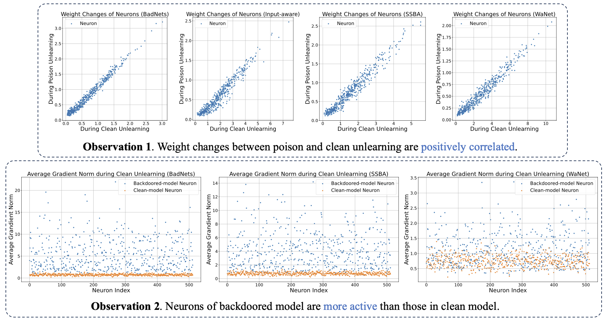
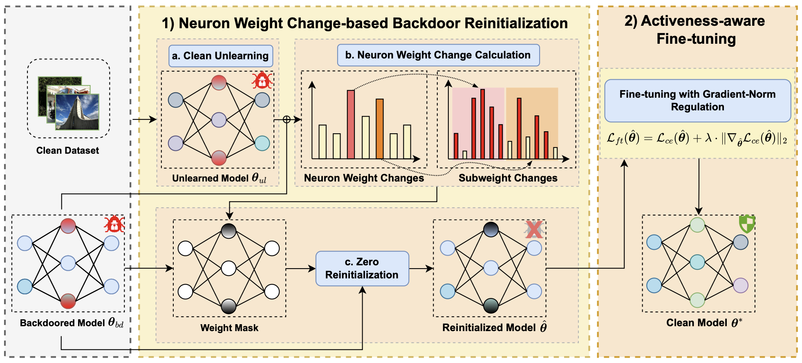

# Unveiling and Mitigating Backdoor Vulnerabilities based on Unlearning Weight Changes and Backdoor Activeness

> This is the official repository of [Unveiling and Mitigating Backdoor Vulnerabilities based on Unlearning Weight Changes and Backdoor Activeness](https://arxiv.org/abs/2405.20291). The paper is accepted by NeurIPS 2024.

We propose an effective post-training backdoor defense method, **TSBD**, using well-designed techniques for zero reinitialization and fine-tuning.


## Overview
### Observations
<div align=center>

</div>

We are inspired by two interesting observations on unlearning weight changes (Observation 1) and backdoor activeness (Observation 2) as in the figure above:

- Observation 1 tells us that the neurons exhibiting significant weight
changes during clean unlearning also tend to play crucial roles in poison unlearning, indicating a stronger association with backdoor-related activities. Therefore, it inspires us to zero out the high-NWC neuron weights for backdoor mitigation.
- Observation 2 tells us that neurons in the backdoored model are always more active compared to those in the clean model. Therefore, it inspires us to suppress the gradient norm during the learning process if we want to recover it to a clean model.

### Framework

Overview of our proposed TSBD. 

- In Stage 1, referred to as *neuron weight change-based backdoor reinitialization*, we aim to mitigate the backdoor effect with acceptable clean-accuracy sacrificed by conducting *clean unlearning*, *neuron weight change calculation*, and *zero reinitialization*.
- In Stage 2, referred to as *activeness-aware fine-tuning*, we aim to further repair the reinitialized subweights and avoid recovering the backdoor effect again by introducing a gradient-norm regulation into the original loss function.

## Quick Start
### Code File Placement
Note that our code is implemented based on [BackdoorBench](https://github.com/SCLBD/BackdoorBench.git).
Please clone the official code first, and then place our code to the corresponding folders. We provide a configuration file `tsbd/config.yaml` and the implemetation code `tsbd.py`. Please place them under `./config/defense/` folder and `./defense/` folder, respectively:
```
|-- config
    |-- defense
        |-- tsbd/config.yaml
|-- defense
    |-- tsbd.py
```
### Defense


This is a demo script of running TSBD defense on CIFAR-10 for BadNets attack. Before defense, you need to obtain the attacked model first. Then, you may use the corresponding result folder name as `result_file` (badnet_0_1 as the example below) and run TSBD:

```
python ./defense/tsbd.py --result_file badnet_0_1 --yaml_path ./config/defense/tsbd/cofig.yaml --dataset cifar10
```
You can conduct TSBD for other attacks in a similar way. We provide an attack example below. More detailed instructions can be found in [https://github.com/SCLBD/BackdoorBench](https://github.com/SCLBD/BackdoorBench).

### Attack

To obtain the attacked models, you can either download the [open-sourced checkpoints by BackdoorBench](http://backdoorbench.com/model_zoo) or run your own one as below.

This is an attack example using BadNets:
```
python ./attack/badnet.py --yaml_path ./config/attack/prototype/cifar10.yaml --patch_mask_path ./resource/badnet/trigger_image.png  --save_folder_name badnet_0_1
```
After attack you will get a folder with all files saved in `./record/<folder name in record>`, including `attack_result.pt` for attack model and backdoored data, which will be used by following defense methods.

## Citation
If you find this project useful in your research, please consider cite:
```
@article{lin2024unveiling,
  title={Unveiling and Mitigating Backdoor Vulnerabilities based on Unlearning Weight Changes and Backdoor Activeness},
  author={Lin, Weilin and Liu, Li and Wei, Shaokui and Li, Jianze and Xiong, Hui},
  journal={arXiv preprint arXiv:2405.20291},
  year={2024}
}

@inproceedings{backdoorbench,
  title={BackdoorBench: A Comprehensive Benchmark of Backdoor Learning},
  author={Wu, Baoyuan and Chen, Hongrui and Zhang, Mingda and Zhu, Zihao and Wei, Shaokui and Yuan, Danni and Shen, Chao},
  booktitle={Thirty-sixth Conference on Neural Information Processing Systems Datasets and Benchmarks Track},
  year={2022}
}
```